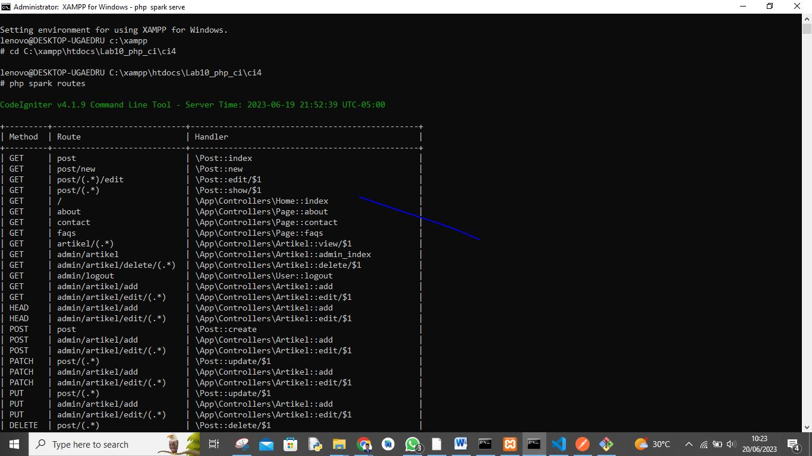
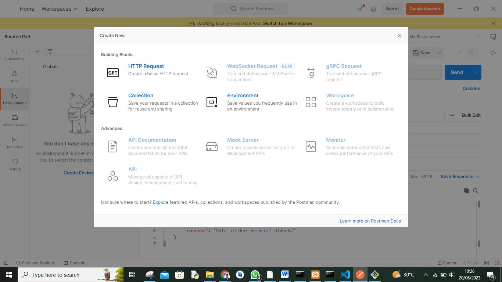
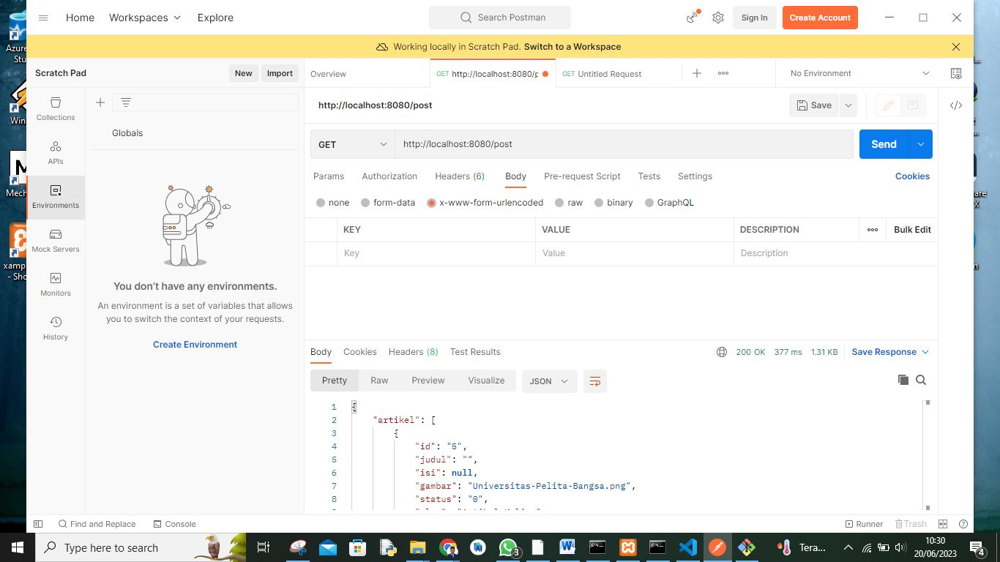
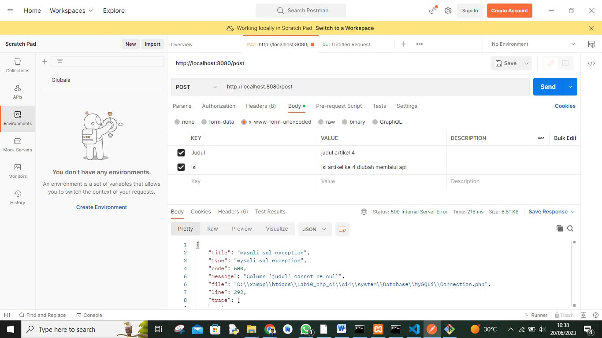
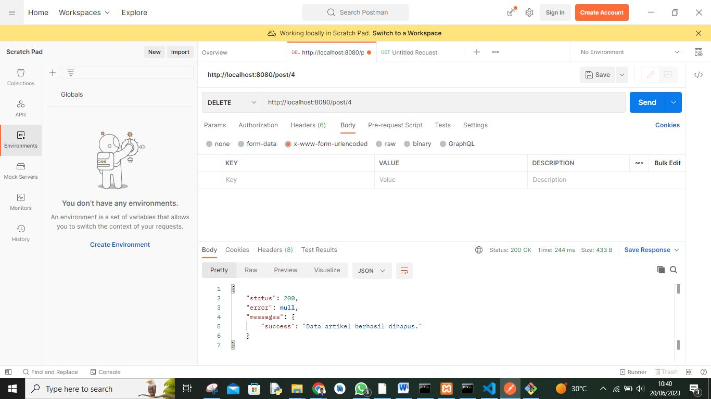

# Pemograman Web2 Pertemuan 14

## Profil
| #               | Biodata                      |
| --------------- | ---------------------------- |
| **Nama**        | M. AKMAL AL ABDILAH          |
| **NIM**         | 312110034                    |
| **Kelas**       | TI.21.A.1                    |
| **Mata Kuliah** | Pemrograman Web 2            |

<p align="center">
 
</p>
<p align="center">
<a href="https://github.com/akmalabdilah"></a>
<p align="center">


<hr>

## Praktikum 12 : postman

<hr>


 
 **`Persiapan`**
 
<p>
Periapan awal adalah mengunduh aplikasi REST Client, ada banyak aplikasi yang dapat digunakan untuk 
keperluan tersebut. Salah satunya adalah Postman. Postman – Merupakan aplikasi yang berfungsi 
sebagai REST Client, digunakan untuk testing REST API. Unduh apliasi Postman dari tautan berikut: 
https://www.postman.com/downloads/
</p>


<p>
Membuat REST Controller
Pada tahap ini, kita akan membuat file REST Controller yang berisi fungsi untuk menampilkan, 
menambah, mengubah dan menghapus data. Masuklah ke direktori app\Controllers dan buatlah file 
baru bernama Post.php. Kemudian, salin kode di bawah ini ke dalam file tersebut:
</p>

```
<?php
namespace App\Controllers;
use CodeIgniter\RESTful\ResourceController;
use CodeIgniter\API\ResponseTrait;
use App\Models\ArtikelModel;
class Post extends ResourceController
{
use ResponseTrait;
// all users
public function index()
{
$model = new ArtikelModel();
$data['artikel'] = $model->orderBy('id', 'DESC')->findAll();
return $this->respond($data);
}
// create
public function create()
{
$model = new ArtikelModel();
$data = [
'judul' => $this->request->getVar('judul'),
'isi' => $this->request->getVar('isi'),
];
$model->insert($data);
$response = [
'status' => 201,
'error' => null,
'messages' => [
'success' => 'Data artikel berhasil ditambahkan.'
]
];
return $this->respondCreated($response);
}
// single user
public function show($id = null)
{
$model = new ArtikelModel();
$data = $model->where('id', $id)->first();
if ($data) {
return $this->respond($data);
} else {
return $this->failNotFound('Data tidak ditemukan.');
}
}
// update
public function update($id = null)
{
$model = new ArtikelModel();
$id = $this->request->getVar('id');
$data = [
'judul' => $this->request->getVar('judul'),
'isi' => $this->request->getVar('isi'),
];
$model->update($id, $data);
$response = [
'status' => 200,
'error' => null,
'messages' => [
'success' => 'Data artikel berhasil diubah.'
]
];
return $this->respond($response);
}
// delete
public function delete($id = null)
{
$model = new ArtikelModel();
$data = $model->where('id', $id)->delete($id);
if ($data) {
$model->delete($id);
$response = [
'status' => 200,
'error' => null,
'messages' => [
'success' => 'Data artikel berhasil dihapus.'
]
];
return $this->respondDeleted($response);
} else {
return $this->failNotFound('Data tidak ditemukan.');
}
}
}
```

<p>
Kode diatas berisi 5 method, yaitu:
• index() – Berfungsi untuk menampilkan seluruh data pada database.
• create() – Berfungsi untuk menambahkan data baru ke database.
• show() – Berfungsi untuk menampilkan suatu data spesifik dari database.
• update() – Berfungsi untuk mengubah suatu data pada database.
• delete() – Berfungsi untuk menghapus data dari database.
</p>

<p>
Membuat Routing REST API
Untuk mengakses REST API CodeIgniter, kita perlu mendefinisikan route-nya terlebih dulu. 
Caranya, masuklah ke direktori app/Config dan bukalah file Routes.php. Tambahkan kode 
di bawah ini:
</p>

```
$routes->resource('post');
```

<p>
Untuk mengecek route nya jalankan perintah berikut
</p>

```
php spark routes
```

<p>
Selanjutnya akan muncul daftar route yang telah dibuat.
</p>



Gambar 1. Upload Gambar

<p>
Testing REST API CodeIgniter
Buka aplikasi postman dan pilih create new → HTTP Request
</p>




<p>
Menampilkan Semua Data
Pilih method GET dan masukkan URL berikut:
http://localhost:8080/post
Lalu, klik Send. Jika hasil test menampilkan semua data artikel dari database, maka pengujian 
berhasil.

</p>




 <p>
 Menampilkan Data Spesifik
Masih menggunakan method GET, hanya perlu menambahkan ID artikel di belakang URL 
seperti ini:
http://localhost:8080/post/2
Selanjutnya, klik Send. Request tersebut akan menampilkan data artikel yang memiliki ID 
nomor 2 di database.
 </p>

 

 
 
 <p>
 Mengubah Data
Untuk mengubah data, silakan ganti method menjadi PUT. Kemudian, masukkan URL artikel
yang ingin diubah. Misalnya, ingin mengubah data artikel dengan ID nomor 2, maka masukkan 
URL berikut:
http://localhost:8080/post/2
Selanjutnya, pilih tab Body. Kemudian, pilih x-www-form-uriencoded. Masukkan nama 
atribut tabel pada kolom KEY dan nilai data yang baru pada kolom VALUE. Kalau sudah, 
klik Send
 </p>
 
 
  
  

<p>
Menambahkan Data
Anda perlu menggunakan method POST untuk menambahkan data baru ke database. 
Kemudian, masukkan URL berikut:
http://localhost:8080/post
Pilih tab Body, lalu pilih x-www-form-uriencoded. Masukkan atribut tabel pada 
kolom KEY dan nilai data baru di kolom VALUE. Jangan lupa, klik Send.

</p>


  


<p>
Menghapus Data
Pilih method DELETE untuk menghapus data. Lalu, masukkan URL spesifik data mana yang 
ingin di hapus. Misalnya, ingin menghapus data nomor 4, maka URL-nya seperti ini:
http://localhost:8080/post/7
Langsung saja klik Send, maka akan mendapatkan pesan bahwa data telah berhasil dihapus dari 
database.

</p>


  

<p>
Pertanyaan dan Tugas
Selesaikan programnya sesuai Langkah-langkah yang ada. Anda boleh melakukan 
improvisasi.

</p>


  <hr>
  
  Cukup Sekian Penjelasan Dari saya
  
  **SELESAI**
  <hr>

<div>
<h2 align="center">Thanks For Reading!!!</h2>
<div align="center">


